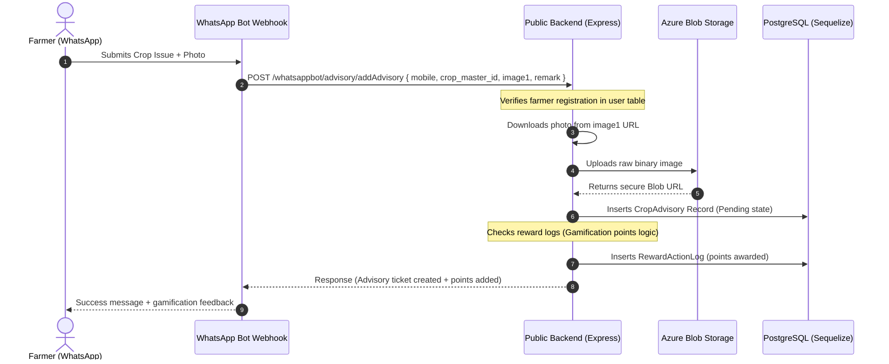

# SmartU WhatsApp Bot Backend

A secure, high-performance microservice designed to power the crop advisory and gamification flow of the **SmartU WhatsApp Bot**. This service allows farmers to seamlessly submit crop health queries (with images) via WhatsApp, uploads crop assets to secure cloud storage, registers advisory tickets, and awards engagement points to farmers.


> [!IMPORTANT]
> **FOR REVIEW & EVALUATION ONLY**  
> This codebase is a submission for the AgriTech Hackathon review process. To respect privacy and prevent exposure of critical internal architecture, this codebase uses minimized Sequelize schemas, dummy configuration guidelines, and lacks automatic database synchronization. It is not intended for direct standalone production deployments.


---

## 🏗️ Architecture & Request Flow

The service acts as the gateway between the WhatsApp bot frontend (communicating via webhooks) and the core platform database. Here is how it functions:



### Request Lifecycle

1. **Webhook Ingestion**: The WhatsApp bot intercepts the farmer's query and forwards a payload containing the farmer's phone number, crop information, text remark, and temporary WhatsApp media URL(s).
2. **User Identification**: The API resolves the farmer's phone number to a valid internal `user_id` using a minimized lookup query.
3. **Asset Pipeline**: The API downloads the image bytes in-memory and streams them to Azure Blob Storage to get a permanent URL.
4. **Advisory Logging**: A pending `CropAdvisory` ticket is created with the reference to the Azure Blob URLs.
5. **Gamification Processing**: The application queries how many advisory queries the farmer has submitted. If they are within reward limits (e.g., < 5, or between 5 and 20), points are dynamically calculated using the action configuration and recorded in `reward_action_log`.

---

## 🔒 Security & Data Privacy (Hackathon Standards)

Privacy and data minimization are core architecture principles of this service to ensure compliance with strict security standards:

*   **Minimized Schema Footprint**: To prevent exposing critical details (such as hashed passwords, emails, names, bank details, or internal settings), the Sequelize models in this codebase define **only** the schema fields required by the WhatsApp bot controller.
*   **Write-Lock Protection**: Database synchronization is completely deactivated (`sync({ alter: true })` or similar are omitted). This ensures that even if this public backend is compromised, it is physically impossible for Sequelize to alter or drop columns from the primary database schema.
*   **Decoupled Associations**: Heavy relational associations (such as user-to-bank-cards or logs-to-coupons) are completely stripped out, making the application lightweight and structurally isolated.

---

## 🎮 Gamification / Rewards Model

To incentivize active farmer participation and crop monitoring, the bot implements a tiered reward action structure:

*   **Tier 1 (`act_advisory1`)**: Awarded for the first 5 crop advisory requests. Provides standard point rewards.
*   **Tier 2 (`act_advisory2`)**: Awarded for requests between the 5th and 20th submissions. Encourages consistent use.
*   **Limit Caps**: Points are capped beyond 20 entries to prevent spamming and abuse.

---

## 🔌 API Endpoints

### 1. Add Crop Advisory (Public Endpoint)
Submit crop diagnostic details directly from the WhatsApp bot channel.

*   **Route**: `POST /whatsappbot/advisory/addAdvisory`
*   **Content-Type**: `application/json`
*   **Payload Example**:
    ```json
    {
      "mobile": "+919876543210",
      "crop_master_id": 12,
      "crop_age": 45,
      "age_type": "days",
      "remark": "Leaves are turning yellow with brown spots.",
      "image1": "https://whatsapp-media-cdn.com/abc123xyz.jpg",
      "query_no": "Q8392"
    }
    ```
*   **Successful Response**:
    ```json
    {
      "success": 1,
      "message": "Crop advisory added successfully",
      "result": {
        "advisory_id": 1045,
        "platform": "whatsapp",
        "user_id": 432,
        "crop_master_id": 12,
        "crop_age": 45,
        "image_path1": "https://smartuappstorage.blob.core.windows.net/krishiclinicdev/advisory_171928472912_1.jpg",
        "status": "Pending",
        "remark": "Leaves are turning yellow with brown spots.",
        "age_type": "days"
      },
      "pointsAdded": 10
    }
    ```

### 2. Add Authenticated Crop Advisory
For requests verified via JWT client tokens.

*   **Route**: `POST /whatsappbot/advisory/addAuthAdvisory`
*   **Headers**: `Authorization: Bearer <JWT_TOKEN>`
*   **Payload**: *Same as public endpoint.*

---

## 🛠️ Technology Stack

*   **Runtime**: Node.js v16+
*   **Framework**: Express.js
*   **ORM**: Sequelize (v6)
*   **Database Client**: pg (PostgreSQL)
*   **Cloud Storage**: Azure Blob Storage SDK (`@azure/storage-blob`)
*   **HTTP Client**: Axios (for raw image downloading)

---

## 🚀 Setup & Installation

1.  **Clone & Install**:
    ```bash
    npm install
    ```
2.  **Environment Setup**:
    ```bash
    cp .env.example .env
    ```
    Configure the variables in `.env` with your database and Azure connection strings.
3.  **Run Development Server**:
    ```bash
    npm run dev
    ```
